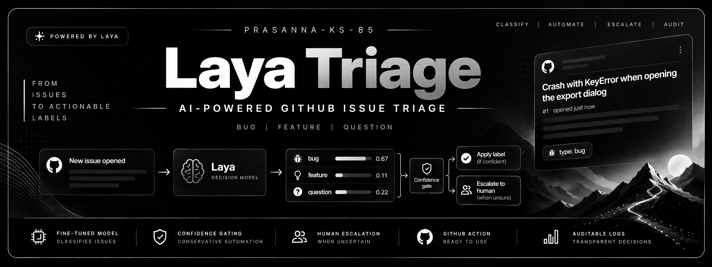
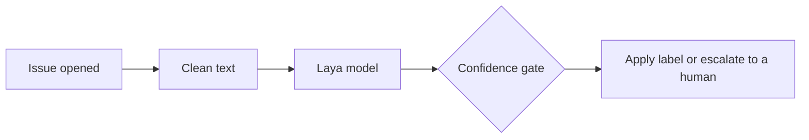

# Laya Triage

<!-- Generated by docs/make_readme.py from docs/README.template.md and files under results/ and config/; do not edit by hand. -->



**Confidence-gated GitHub issue triage powered by a fine-tuned Laya decision model.**

Laya Triage is an open-source GitHub Action that classifies newly opened issues as `bug`, `feature`, or `question`. It runs locally on the GitHub Actions runner's CPU, applies labels only when its confidence policy permits, and routes uncertain predictions to human review.

**No hosted inference server. No per-request API fees. Human review when confidence is insufficient.**

> **Project status:** `v1.0.0` — a personal open-source project. The current default policy automatically applies only sufficiently confident `bug` labels; `feature` and `question` predictions are escalated for human review.

## The 30-second explanation

Maintainers spend time reading each new issue just to decide what kind it is. Keyword bots are brittle; LLM bots are slow, cost money per call and cannot say how sure they are. Laya Triage asks a fine-tuned model one multiple-choice question, reads a calibrated probability for each answer, and acts only when that probability clears a threshold.

| Part | What it is | Whose work |
|---|---|---|
| **Laya** | The decision engine: an encoder model that answers typed multiple-choice questions with probabilities instead of writing text. | Upstream, by Convai Innovations ([source](https://github.com/NandhaKishorM/laya)); not our work |
| **Our fine-tuned model** | Laya fine-tuned on NLBSE'24 issues to choose between bug, feature and question: [`Prasanna85/laya-issue-triage`](https://huggingface.co/Prasanna85/laya-issue-triage) on Hugging Face. | This project |
| **The GitHub Action** | This repository's code: it runs the model on each new issue, applies the confidence gate, then adds a label or escalates. | This project |



**Why Laya instead of a plain classifier?** A standard fine-tuned classifier would also work for three fixed classes, and we did not run a same-protocol head-to-head against one, so we make no accuracy claim. We chose Laya because the labels and their descriptions are part of the model's input and it answers typed questions (pick one, yes/no, rate) with probabilities in one CPU pass. That is meant to make follow-up questions such as "is the report missing reproduction steps?" a smaller step than building a second classifier ([more](docs/DEEP_DIVE.md#why-laya-instead-of-a-plain-classifier)).

## One worked example

We wrote a set of sandbox issues about a fictional app (`sandbox/issues.json`). This is fixture S01, end to end:

**Crash with KeyError when opening the export dialog**

<details>
<summary>Show the issue text</summary>

````text
After updating to 3.2.0 the app closes as soon as I open File > Export.

Steps:
1. Open any notebook
2. Choose File > Export

```
Traceback (most recent call last):
  File "paperkite/ui/export.py", line 88, in open_dialog
    fmt = settings["last_format"]
KeyError: 'last_format'
```

Expected: the export dialog opens. OS: Fedora 40, Python 3.12.
````

</details>

- **Clean text.** `preprocess()` turns the title and body into the model's input (long logs collapsed, links and images replaced).
- **Laya model.** One forward pass gives one probability per label: `bug` **0.6714**, `feature` 0.1052, `question` 0.2234.
- **Confidence gate.** The top label is `bug` at 0.6714, and the `bug` threshold is 0.6033. The probability clears the threshold, so the label is applied.
- **On GitHub.** In apply mode the Action adds `type: bug` to the issue. In dry-run, the default, it writes the same decision to the run's job summary and changes nothing.

| Fixture | Top label | Confidence | Threshold | Outcome |
|---|---|---:|---:|---|
| S02 *Sync stopped working after upgrading from 3.1.4 to 3.2.0* | `bug` | 0.5438 | 0.6033 | below the threshold: escalated with `triage: needs-human` |
| S05 *How do I change the default notebook folder?* | `question` | 0.9584 | never (1.01) | confident, but `question` is never auto-applied: escalated |

These values come from the production code path run locally (`sandbox/expected_local.json`); on a GitHub-hosted runner all 22 sandbox issue runs matched them ([results/phase4.md](results/phase4.md)).

<!-- Demo: add docs/demo.gif, then replace this comment with  -->

## Results and limitations

On the NLBSE'24 test split (1,500 issues from 5 repositories). The test evaluation was pre-declared and run once; later exploratory analyses reused its predictions and are labelled post-hoc.

| System | Cross-repo macro-F1 | Calibration error (ECE) |
|---|---:|---:|
| **Our model (fine-tuned Laya)** | **0.8020** | 0.0454 |
| TF-IDF + logistic regression | 0.7655 | 0.0493 |
| Zero-shot Laya (no fine-tuning) | 0.6108 | 0.0684 |

On this benchmark the fine-tuned model picks the right type for about 80% of issues. Unfamiliar terms (precision, threshold, calibration) are explained in the [glossary](docs/DEEP_DIVE.md#glossary).

Macro-F1: higher is better. Calibration error: lower means a stated probability is closer to how often the model is actually right. The published NLBSE'24 SetFit result (0.8270) used a different protocol, one classifier per repository, so it is not a like-for-like comparison ([details](docs/DEEP_DIVE.md#evaluation)).

**Two targets were missed:**

- **Precision.** The goal was a precision of at least 90% for the labels the Action applies by itself. With the shipped thresholds the Action labelled 26.1% of test issues, all `bug`, at precision 87.5%: the 90% precision target was missed on test. In practice, expect some wrong `bug` labels, which a maintainer can remove.
- **Speed per issue.** On a GitHub-hosted runner with 2 logical CPUs, the slowest one issue in twenty took 3.5 seconds or longer, against a goal of at most 1 second: the speed target was missed ([details](docs/DEEP_DIVE.md#runtime-and-the-latency-probe)). The whole job still took 1m26s on the first run and 44s to 56s on later runs, once caches are restored, and the default Action only labels the bugs it is most sure about and sends the rest to a human.

**Key limitations** (the full list is in [the deep dive](docs/DEEP_DIVE.md#limitations)):

- **English only**, with no language guard: a German sandbox issue (S17) was labelled `bug` with confidence above the threshold.
- **Only `bug` is ever auto-applied** with the default thresholds; `feature` and `question` always go to a human.
- **Balanced benchmark data** from 5 large projects: precision on your repository will differ, so watch dry-run output first.
- **Issue text can steer the label**, within bounds: the output is one of three labels, and no issue text is executed or repeated.
- **Validation overstated test performance** (cross-repo macro-F1 0.8691 on validation, 0.8020 on test).
- **Exactly three classes.** Adding a class is not a setting: it needs new labelled data, retraining and recalibrating ([details](docs/DEEP_DIVE.md#extending-to-more-classes)).

## Choose how to use it

**Path A, the GitHub Action, needs no code.** **Path B, the model on its own, is for people who want the probabilities in their own Python code.**

### Path A: the GitHub Action

**Step one.** Save this as `.github/workflows/laya-triage.yml`:

```yaml
name: Laya Triage
on:
  issues:
    types: [opened]

permissions:
  issues: write
  contents: read

jobs:
  triage:
    runs-on: ubuntu-latest
    timeout-minutes: 20
    steps:
      - uses: actions/checkout@3d3c42e5aac5ba805825da76410c181273ba90b1 # v7.0.1 (reads the config file)
        with:
          persist-credentials: false
      - uses: Prasanna-KS-85/laya-triage@v1.0.0
```

`v1.0.0` is a tag, and tags can move. For anything beyond a trial, pin the release commit: `git ls-remote https://github.com/Prasanna-KS-85/laya-triage 'refs/tags/v1.0.0^{}'` prints its SHA; then write `uses: Prasanna-KS-85/laya-triage@<that SHA> # v1.0.0`.

**Step two.** Open an issue. The run is in dry-run, the default: read the decision table in the run's job summary. Nothing is written to the issue. Until you add the optional scheduled cache warm-up from the guide, each run installs everything from scratch and takes about 1m26s.

**Step three.** When you trust what dry-run shows, add `.github/laya-triage.yml`:

```yaml
behaviour:
  mode: apply
```

In apply mode the labels must already exist in your repository; the guide has the commands to create them. The full guide (labels, cache warm-up, backfill, configuration, troubleshooting) is [docs/USING_THE_ACTION.md](docs/USING_THE_ACTION.md).

### Path B: the model on its own

Install with `pip install "laya_triage @ git+https://github.com/Prasanna-KS-85/laya-triage@v1.0.0"`. On Linux, the CPU-only install in [docs/USING_THE_MODEL.md](docs/USING_THE_MODEL.md#install) avoids the much larger GPU (CUDA) build of torch. Then:

```python
"""Classify one issue with the Laya Triage model on CPU (fp32). Install: see docs/USING_THE_MODEL.md."""
# The package brings the frozen question and the shared preprocess(): nothing is retyped.
from laya_triage.classifier import Classifier
from laya_triage.preprocess import preprocess

REPO = "Prasanna85/laya-issue-triage"
REVISION = "76ece1fb0eb8b32bd5d8c509293c1692a2534805"  # pinned: the revision the Action uses
MAX_LEN = 1024  # must equal the training budget
BUG_THRESHOLD = 0.6033  # the Action's default gate; feature and question are never auto-applied

model = Classifier(REPO, REVISION, MAX_LEN)  # downloads once, then loads from the local cache
state = preprocess("App closes when I open the export dialog",
                   "Steps: open a notebook, choose File > Export. The app exits with KeyError: 'last_format'.")
result = model.classify(state, issue_number=0)
print(result.probabilities)  # {'bug': ..., 'feature': ..., 'question': ...}
confident_bug = result.label == "bug" and result.answer_confidence >= BUG_THRESHOLD
print("apply bug" if confident_bug else "escalate to a human")
```

More in [docs/USING_THE_MODEL.md](docs/USING_THE_MODEL.md) (CPU-only install, what the output means, offline use) and on the [Hugging Face model card](https://huggingface.co/Prasanna85/laya-issue-triage).

## Technical deep dive

[Glossary](docs/DEEP_DIVE.md#glossary) · [Architecture](docs/DEEP_DIVE.md#architecture-at-a-glance) · [Laya internals](docs/DEEP_DIVE.md#how-it-works-laya-internals) · [Why Laya](docs/DEEP_DIVE.md#why-laya-instead-of-a-plain-classifier) · [Training and data](docs/DEEP_DIVE.md#training-and-data) · [Calibration](docs/DEEP_DIVE.md#calibration) · [Evaluation](docs/DEEP_DIVE.md#evaluation) · [Gating](docs/DEEP_DIVE.md#gating-and-the-missed-target) · [Runtime](docs/DEEP_DIVE.md#runtime-and-the-latency-probe) · [Deployment](docs/DEEP_DIVE.md#deployment-and-caches) · [Security](docs/DEEP_DIVE.md#security) · [Reproduce](docs/DEEP_DIVE.md#reproduce) · [Limitations](docs/DEEP_DIVE.md#limitations) · [More classes](docs/DEEP_DIVE.md#extending-to-more-classes) · [Roadmap](docs/DEEP_DIVE.md#roadmap) · [How this was built](docs/DEEP_DIVE.md#how-this-was-built)

| Path | What it holds |
|---|---|
| [`PROJECT_SPEC.md`](PROJECT_SPEC.md) | the single source of truth: requirements, decisions, gates, changelog |
| [`docs/`](docs/) | the deep dive, the two usage guides, the model card, their generator and templates, the diagrams |
| [`docs/report/`](docs/report/) | the technical report: generator, chapter templates, source text and tests |
| [`src/laya_triage/`](src/laya_triage/) | the run-time package |
| [`action.yml`](action.yml), [`constraints-linux.txt`](constraints-linux.txt) | the composite Action and its pinned dependency lock |
| [`config/triage.default.yml`](config/triage.default.yml) | model revision, thresholds, labels, defaults |
| [`training/`](training/) | dataset build, shared item packing, the Kaggle notebook |
| [`eval/`](eval/) | baselines, evaluation, gating, plots |
| [`results/`](results/) | every metric file, figure and run record the docs are generated from |
| [`sandbox/`](sandbox/) | the end-to-end fixtures, comparison script and runbook |
| [`tests/`](tests/) | unit tests, and the slow model tests that run offline |

Questions or feedback: open an issue in this repository.

**Full technical report.** The complete write-up, from the problem and the data to the results, the limitations and future work: [PDF, attached to the release](https://github.com/Prasanna-KS-85/laya-triage/releases/download/v1.0.0/laya-triage-report.pdf) or [readable on GitHub](docs/report/REPORT.md).

Laya is by Convai Innovations / NandhaKishorM (Apache-2.0); the benchmark is NLBSE'24. This project is Apache-2.0 ([`LICENSE`](LICENSE)); credits and citations are in [the deep dive](docs/DEEP_DIVE.md#credits-and-license).
