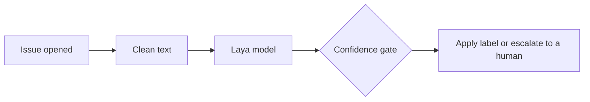

# Laya Triage

<!-- Generated by docs/make_readme.py from docs/README.template.md and files under results/ and config/; do not edit by hand. -->


**Confidence-gated GitHub issue triage powered by a fine-tuned Laya decision model.**

Laya Triage is an open-source GitHub Action that classifies newly opened issues as `bug`, `feature`, or `question`. It runs locally on the GitHub Actions runner's CPU, applies labels only when its confidence policy permits, and routes uncertain predictions to human review.

**No hosted inference server. No per-request API fees. Human review when confidence is insufficient.**

> **Project status:** `{{tag}}` — a personal open-source project. The current default policy automatically applies only sufficiently confident `bug` labels; `feature` and `question` predictions are escalated for human review.

## The 30-second explanation

Maintainers spend time reading each new issue just to decide what kind it is. Keyword bots are brittle; LLM bots are slow, cost money per call and cannot say how sure they are. Laya Triage asks a fine-tuned model one multiple-choice question, reads a calibrated probability for each answer, and acts only when that probability clears a threshold.

| Part | What it is | Whose work |
|---|---|---|
| **Laya** | The decision engine: an encoder model that answers typed multiple-choice questions with probabilities instead of writing text. | Upstream, by Convai Innovations ([source]({{laya_url}})); not our work |
| **Our fine-tuned model** | Laya fine-tuned on NLBSE'24 issues to choose between bug, feature and question: [`{{model_repo}}`]({{hf_url}}) on Hugging Face. | This project |
| **The GitHub Action** | This repository's code: it runs the model on each new issue, applies the confidence gate, then adds a label or escalates. | This project |



## One worked example

We wrote a set of sandbox issues about a fictional app (`sandbox/issues.json`). This is fixture S01, end to end:

**{{s01_title}}**

<details>
<summary>Show the issue text</summary>

````text
{{s01_body}}
````

</details>

- **Clean text.** `preprocess()` turns the title and body into the model's input (long logs collapsed, links and images replaced).
- **Laya model.** One forward pass gives one probability per label: `bug` **{{s01_bug}}**, `feature` {{s01_feature}}, `question` {{s01_question}}.
- **Confidence gate.** The top label is `bug` at {{s01_conf}}, and the `bug` threshold is {{s01_tau}}. The probability clears the threshold, so the label is applied.
- **On GitHub.** In apply mode the Action adds `{{s01_outcome_label}}` to the issue. In dry-run, the default, it writes the same decision to the run's job summary and changes nothing.

| Fixture | Top label | Confidence | Threshold | Outcome |
|---|---|---:|---:|---|
| S02 *{{s02_title}}* | `{{s02_label}}` | {{s02_conf}} | {{s02_tau}} | below the threshold: escalated with `{{s02_outcome_label}}` |
| S05 *{{s05_title}}* | `{{s05_label}}` | {{s05_conf}} | {{s05_tau}} | confident, but `question` is never auto-applied: escalated |

These values come from the production code path run locally (`sandbox/expected_local.json`); on a GitHub-hosted runner all {{sandbox_runs}} sandbox issue runs matched them ([results/phase4.md](results/phase4.md)).

<!-- Demo: add docs/demo.gif, then replace this comment with  -->

## Results and limitations

On the NLBSE'24 test split ({{n_test}} issues from {{n_repos}} repositories). The test evaluation was pre-declared and run once; later exploratory analyses reused its predictions and are labelled post-hoc.

{{short_results_table}}

On this benchmark the fine-tuned model picks the right type for about {{m1_acc_pct}} of issues. Unfamiliar terms (precision, threshold, calibration) are explained in the [glossary](docs/DEEP_DIVE.md#glossary).

Macro-F1: higher is better. Calibration error: lower means a stated probability is closer to how often the model is actually right. The published NLBSE'24 SetFit result ({{setfit_xrepo}}) used a different protocol, one classifier per repository, so it is not a like-for-like comparison ([details](docs/DEEP_DIVE.md#evaluation)).

**Two targets were missed:**

- **Precision.** The goal was a precision of at least {{target_pct}} for the labels the Action applies by itself. With the shipped thresholds the Action labelled {{gate_cov_pct}} of test issues, all `bug`, at precision {{gate_prec_pct}}: the {{target_pct}} precision target was {{target_status}} on test. In practice, expect some wrong `bug` labels, which a maintainer can remove.
- **Speed per issue.** On a GitHub-hosted runner with {{runner_cpus}} logical CPUs, the slowest one issue in twenty took {{probe_p95_secs}} seconds or longer, against a goal of at most {{nfr1_goal}}: the speed target was {{latency_status}} ([details](docs/DEEP_DIVE.md#runtime-and-the-latency-probe)). The whole job still took {{cold}} on the first run and {{warm_range}} on later runs, once caches are restored, and the default Action only labels the bugs it is most sure about and sends the rest to a human.

**Key limitations** (the full list is in [the deep dive](docs/DEEP_DIVE.md#limitations)):

- **English only**, with no language guard: a German sandbox issue (S17) was labelled `bug` with confidence above the threshold.
- **Only {{auto_label}} is ever auto-applied** with the default thresholds; `feature` and `question` always go to a human.
- **Balanced benchmark data** from {{n_repos}} large projects: precision on your repository will differ, so watch dry-run output first.
- **Issue text can steer the label**, within bounds: the output is one of three labels, and no issue text is executed or repeated.
- **Validation overstated test performance** (cross-repo macro-F1 {{val_xrepo}} on validation, {{test_xrepo}} on test).

## Choose how to use it

**Path A, the GitHub Action, needs no code.** **Path B, the model on its own, is for people who want the probabilities in their own Python code.**

### Path A: the GitHub Action

**Step one.** Save this as `.github/workflows/laya-triage.yml`:

```yaml
{{snippet_consumer_minimal}}
```

`{{tag}}` is a tag, and tags can move. For anything beyond a trial, pin the release commit: `{{ls_remote}}` prints its SHA; then write `uses: Prasanna-KS-85/laya-triage@<that SHA> # {{tag}}`.

**Step two.** Open an issue. The run is in dry-run, the default: read the decision table in the run's job summary. Nothing is written to the issue. Until you add the optional scheduled cache warm-up from the guide, each run installs everything from scratch and takes about {{cold}}.

**Step three.** When you trust what dry-run shows, add `.github/laya-triage.yml`:

```yaml
behaviour:
  mode: apply
```

In apply mode the labels must already exist in your repository; the guide has the commands to create them. The full guide (labels, cache warm-up, backfill, configuration, troubleshooting) is [docs/USING_THE_ACTION.md](docs/USING_THE_ACTION.md).

### Path B: the model on its own

Install with `pip install "laya_triage @ git+{{github_url}}@{{tag}}"`. On Linux, the CPU-only install in [docs/USING_THE_MODEL.md](docs/USING_THE_MODEL.md#install) avoids the much larger GPU (CUDA) build of torch. Then:

```python
{{snippet_classify_one}}
```

More in [docs/USING_THE_MODEL.md](docs/USING_THE_MODEL.md) (CPU-only install, what the output means, offline use) and on the [Hugging Face model card]({{hf_url}}).

## Technical deep dive

[Glossary](docs/DEEP_DIVE.md#glossary) · [Architecture](docs/DEEP_DIVE.md#architecture-at-a-glance) · [Laya internals](docs/DEEP_DIVE.md#how-it-works-laya-internals) · [Training and data](docs/DEEP_DIVE.md#training-and-data) · [Calibration](docs/DEEP_DIVE.md#calibration) · [Evaluation](docs/DEEP_DIVE.md#evaluation) · [Gating](docs/DEEP_DIVE.md#gating-and-the-missed-target) · [Runtime](docs/DEEP_DIVE.md#runtime-and-the-latency-probe) · [Deployment](docs/DEEP_DIVE.md#deployment-and-caches) · [Security](docs/DEEP_DIVE.md#security) · [Reproduce](docs/DEEP_DIVE.md#reproduce) · [Limitations](docs/DEEP_DIVE.md#limitations) · [Roadmap](docs/DEEP_DIVE.md#roadmap) · [How this was built](docs/DEEP_DIVE.md#how-this-was-built)

| Path | What it holds |
|---|---|
| [`PROJECT_SPEC.md`](PROJECT_SPEC.md) | the single source of truth: requirements, decisions, gates, changelog |
| [`docs/`](docs/) | the deep dive, the two usage guides, the model card, their generator and templates, the diagrams |
| [`src/laya_triage/`](src/laya_triage/) | the run-time package |
| [`action.yml`](action.yml), [`constraints-linux.txt`](constraints-linux.txt) | the composite Action and its pinned dependency lock |
| [`config/triage.default.yml`](config/triage.default.yml) | model revision, thresholds, labels, defaults |
| [`training/`](training/) | dataset build, shared item packing, the Kaggle notebook |
| [`eval/`](eval/) | baselines, evaluation, gating, plots |
| [`results/`](results/) | every metric file, figure and run record the docs are generated from |
| [`sandbox/`](sandbox/) | the end-to-end fixtures, comparison script and runbook |
| [`tests/`](tests/) | unit tests, and the slow model tests that run offline |

Questions or feedback: open an issue in this repository.

Laya is by Convai Innovations / NandhaKishorM (Apache-2.0); the benchmark is NLBSE'24. This project is Apache-2.0 ([`LICENSE`](LICENSE)); credits and citations are in [the deep dive](docs/DEEP_DIVE.md#credits-and-license).
